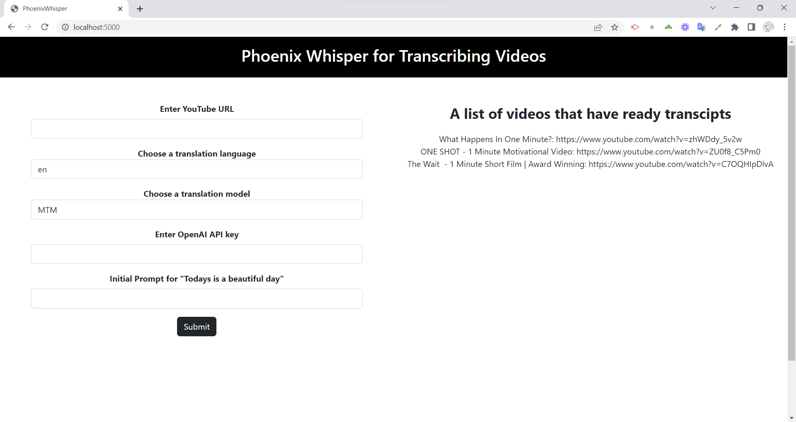
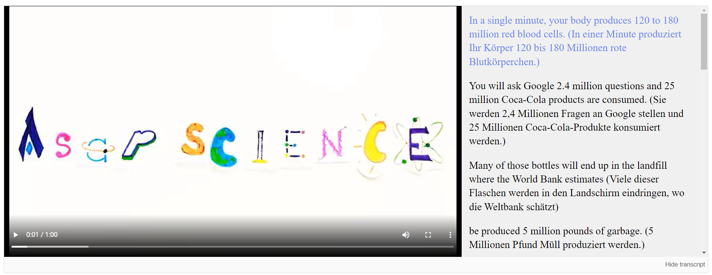

# PhoenixWhisper

## About
This is the project using OpenAI Whisper with GPT/MTM language model to create <b>a language learning platform</b> that lets you watch your favorite YouTube videos with dual interactive transcripts


<br />


## User Guide
<b> There are two options to translate your favorite YouTube video. </b>In both cases, you will need a valid YouTube URL and a language code in [2 letters](https://www.andiamo.co.uk/resources/iso-language-codes/) that you want the translation, then if you 
1. Use OpenAI GPT
  - Choose GPT as the translation model
  - Enter your API key, you can get one from your dashboard
  - The "Initial Prompt" is the translation of "Today is a beautiful day" in the language that you chose above. For example, if I choose "vi" (which stands for Vietnamese), I need to write "Hôm nay trời đẹp quá" as the answer (the translation of "Today is a beautiful day" in Vietnamese)
2. Using Meta's language model MTM
  - Just click submit after you write the URL and the language code. You're done! :)

Now let's make some coffee while our backend generates the transcripts for you. After the page is ready, enjoy the script! :heart_eyes: (and your coffee too)
## Installation

Create virtual environment
```bash
cd webapp

python -m venv venv

source venv/Scripts/activate (Windows)
```

Install dependencies for Python
```bash
pip install --upgrade pytube 

pip install git+https://github.com/openai/whisper.git -q

pip install flask openai sentencepiece
```

Run the web app locally at port 5000
```bash
python app.py or flask run
```


This is the project fo the Phoenix team in Whisper Hackathon from OpenAI